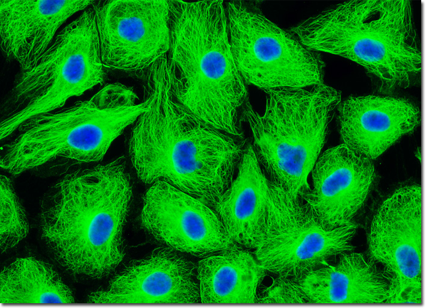
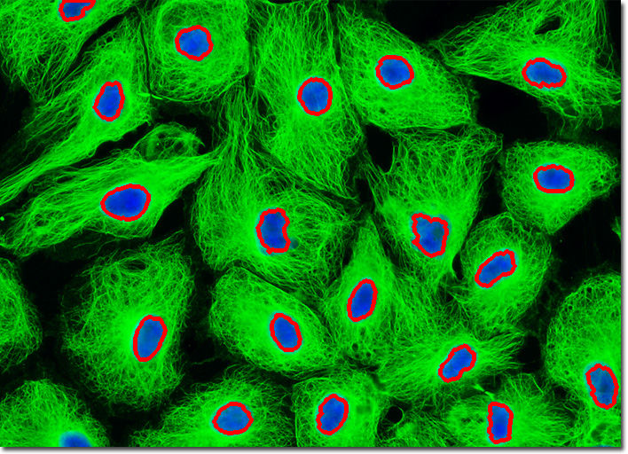
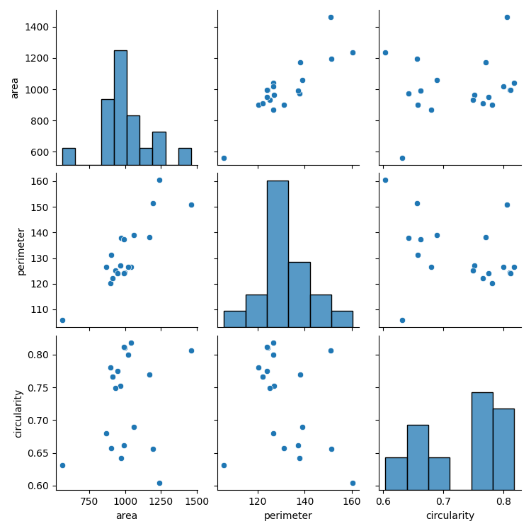
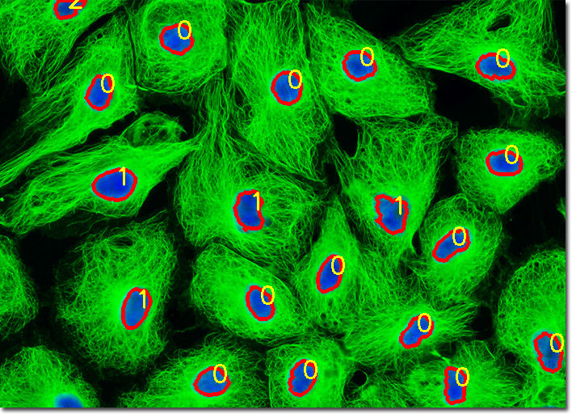

# Bioinformatics REST API

## Overview
This repository provides a REST API for DNA sequence analysis, nuclei segmentation, and machine learning-based analysis of microscopic nuclei shape features. The API is implemented using FastAPI and includes functionality for computing GC content, generating reverse complements, transcribing DNA to RNA, analyzing microscopic images for nuclei segmentation, and performing machine learning analysis on nuclei shape data.

---

## **Setting Up the Environment**

Clone this repository in your method of preference

To install the required dependencies, run:
```sh
pip install -r requirements.txt
```

Ensure all dependencies are correctly installed before running the API.

---

## **DNA Sequence Analysis**

### **Starting the API**
Navigate to the `scripts` directory and run the FastAPI server:
```sh
uvicorn scripts.bioinformatics_api:app --host 0.0.0.0 --port 8000 --reload
```

### **Checking if the API is Running**
Open a new terminal and execute:
```sh
curl -X GET "http://127.0.0.1:8000/"
```
#### **Expected Response:**
```json
{"message":"Welcome to the Bioinformatics REST API"}
```

### **Available Endpoints**

#### **1. Calculate GC Content**
```sh
curl -X POST "http://127.0.0.1:8000/gc-content/"      -H "Content-Type: application/json"      -d '{"sequence": "ATGCGC"}'
```
##### **Expected Response:**
```json
{"sequence":"ATGCGC","gc_content":66.67}
```

#### **2. Get Reverse Complement**
```sh
curl -X POST "http://127.0.0.1:8000/reverse-complement/"      -H "Content-Type: application/json"      -d '{"sequence": "ATGCGC"}'
```
##### **Expected Response:**
```json
{"sequence":"ATGCGC","reverse_complement":"GCGCAT"}
```

#### **3. Transcribe DNA to RNA**
```sh
curl -X POST "http://127.0.0.1:8000/transcribe/"      -H "Content-Type: application/json"      -d '{"sequence": "ATGCGC"}'
```
##### **Expected Response:**
```json
{"sequence":"ATGCGC","transcription":"AUGCGC"}
```

---

## **Nuclei Segmentation**

### **Uploading an Image for Analysis**
```sh
curl -X POST "http://127.0.0.1:8000/analyze-image/"      -H "accept: application/json"      -H "Content-Type: multipart/form-data"      -F "file=@./asset/microscopic_sample.jpg"
```
##### **Sample input image:**
 "microscopic_sample.jpg" is provided in asset folder 

##### **Expected Response:**
```json
{"filename":"microscopic_sample.jpg",
  "num_cells_detected":19,
  "processed_image_url":"http://127.0.0.1:8000/download/microscopic_sample.png",
  "nuclei_shape_dataframe":"http://127.0.0.1:8000/download/microscopic_sample.csv",
  "nuclei_contour":"http://127.0.0.1:8000/download/microscopic_sample.geojson"}
```

##### **Click the processed_image_url to download the segmented nuclei image:**


Generated a CSV file that contains 
[Nuclei Shape Features](./asset/readme_asset/microscopic_samplenuclei_shape_features.csv)

Saved the nuclei contours into a geojson file which can be interacted with [QuPath software](https://qupath.github.io/) as shown below


---

## **Machine Learning Analysis on Nuclei Shape Features**

### **1. Exploratory Data Analysis (EDA)**
```sh
curl -X GET "http://127.0.0.1:8000/eda?csv_path=./asset/processed_images/microscopic_sample.csv"
```
##### **Expected Response:**
Returns JSON-formatted summary statistics of the dataset.
```json
{"area":{"count":19.0,"mean":1007.0,"std":180.77449119460042,"min":561.5,"25%":922.25,"50%":992.5,"75%":1052.0,"max":1461.5},
  "perimeter":{"count":19.0,"mean":131.5284210526316,"std":12.821711301606909,"min":105.7,"25%":124.155,"50%":126.67,"75%":138.055,"max":160.47},
  "circularity":{"count":19.0,"mean":0.7300000000000001,"std":0.0726483157256779,"min":0.6,"25%":0.66,"50%":0.75,"75%":0.79,"max":0.82}}
```
### **2. Pairplot Visualizats
```sh
curl -X GET "http://127.0.0.1:8000/pairplot?csv_path=./asset/processed_images/microscopic_sample.csv" --output "./asset/processed_images/pairplot.png"
```
##### **Expected Response:**
Generate an image file showing pairwise relationships in the dataset.


### **3. K-Means Clustering**
```sh
curl -X GET "http://127.0.0.1:8000/kmeans?csv_path=./asset/processed_images/microscopic_sample.csv"
```
##### **Expected Response:**
```json
{"clusters":[0,0,0,0,0,1,0,0,0,1,1,1,0,0,0,0,0,0,2],"centroids":[[964.7142857142857,128.0275702902249,0.7424552692749306],[1266.375,150.23580291867256,0.709093381954237],[561.5,105.6984841823578,0.6315708925691229]]}
```
Output cluster overlaid nuclei image as shown below




### **4. Principal Component Analysis (PCA) Visualization**
```sh
curl -X GET "http://127.0.0.1:8000/pca?csv_path=./asset/processed_images/microscopic_sample.csv" --output "./asset/processed_images/pca_plot.png"
```
##### **Expected Response:**
Returns an image file showing a 2D visualization of the dataset after PCA dimensionality reduction.

### **5. Upload a New CSV File for Analysis**
```sh
curl -X POST "http://127.0.0.1:8000/upload_csv"      -H "accept: application/json"      -H "Content-Type: multipart/form-data"      -F "file=@./asset/processed_images/new_dataset.csv"
```
##### **Expected Response:**
```json
{"message": "CSV uploaded successfully", "filename": "new_dataset.csv"}
```
Allows users to upload a new dataset for analysis.

---

## **Contributions & Support**
For any issues or contributions, please open a pull request or issue on this repository.
