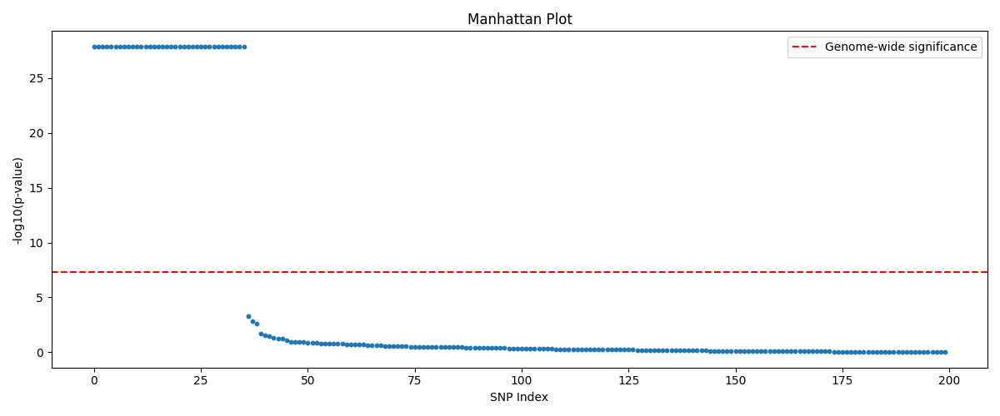
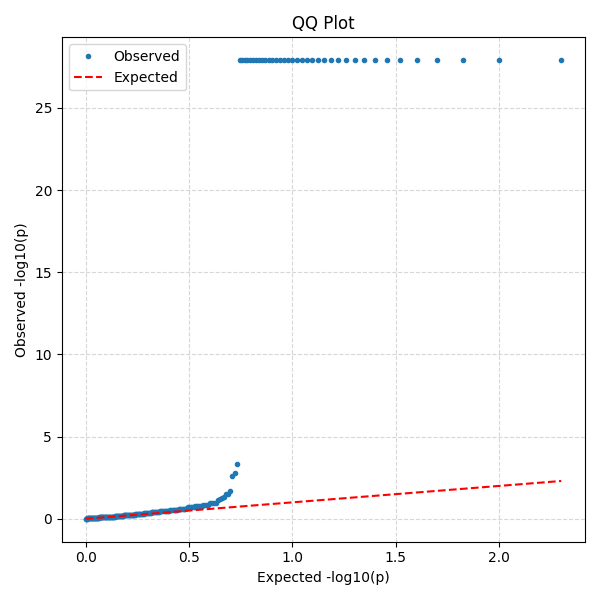
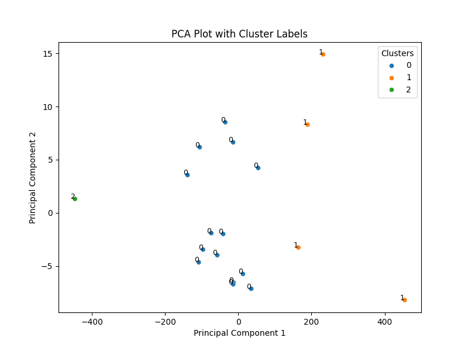

# 🧬 Bioinformatics REST API

## 🚀 Overview
Welcome to the **Bioinformatics REST API**, a FastAPI-powered service for:

- 🔬 **DNA Sequence Analysis**
- 🧠 **Microscopic Nuclei Segmentation**
- 🤖 **Machine Learning on Nuclei Shape Features**

This API enables bioinformatics workflows with just a few HTTP calls — from GC content analysis to K-means clustering of nuclei shapes.

---

## 🐳 Setup: Docker Environment

### 🔧 Build the Docker Image
```bash
docker build -t bioinformatics_restapi .
```

### 🚦 Run the Container
```bash
docker run -d -p 8000:8000 bioinformatics_restapi
```
### 🔍 Check if it's running
```bash
curl -X GET "http://127.0.0.1:8000/"
```
**Expected:**
```json
{"message":"Welcome to the Bioinformatics REST API"}
```

---

## 🧪 DNA Sequence Analysis
### 🔬 Example Request to /sequence/rdf 
#### 1️⃣ GC Content  2️⃣ Reverse Complement  3️⃣ Transcription (DNA ➜ RNA)
```bash
curl -X POST "http://localhost:8000/sequence/rdf" -H "Content-Type: application/json" -d '{"sequence": "ATGCGC"}'
```
**Response:**
```json
@prefix bio: <http://example.org/bio#> .
@prefix xsd: <http://www.w3.org/2001/XMLSchema#> .

<http://example.org/sequence/4cd8a511-82b8-473c-8174-47514e83150c> a bio:DNASequence ;
    bio:gcContent "66.67"^^xsd:float ;
    bio:reverseComplement "GCGCAT" ;
    bio:sequence "ATGCGC" ;
    bio:transcript "AUGCGC" .
```

### 🔎 Example Request to /sparql
```bash
curl -X POST http://localhost:8000/sparql \
  -H "Content-Type: application/json" \
  -d '{"query": "SELECT * WHERE { ?s a <http://example.org/bio#DNASequence> . }"}'
```

**SPARQL Query:**
```
SELECT * WHERE {
  ?s a <http://example.org/bio#DNASequence> .
}
```
**Response:**
```json
{"results":[{"var0":"http://example.org/sequence/4cd8a511-82b8-473c-8174-47514e83150c"}]}
```

---

## 🧪 Multivariate GWAS (Genome-Wide Association Studies)
### 🔬 Endpoints
### 1. **Download Genotype Data (VCF) from AWS**


The pipeline begins by retrieving genotype data from a specified URL. This file is expected to be in VCF format, optionally compressed (e.g., `.vcf.gz`). The downloaded file is stored locally for subsequent processing.

---
Download a VCF file from a public URL (e.g., AWS 1000 Genomes):

```bash
curl -X GET "http://127.0.0.1:8000/download-vcf?url=https://1000genomes.s3.amazonaws.com/release/20130502/ALL.chr22.phase3_shapeit2_mvncall_integrated_v5a.20130502.genotypes.vcf.gz"
```

**Response:**
```json
{
  "message": "VCF file downloaded",
  "path": "./asset/generated_output/ALL.chr22.phase3_shapeit2_mvncall_integrated_v5a.20130502.genotypes.vcf.gz"
}
```

---

### 2. **Run GWAS**

```bash
curl -X GET "http://127.0.0.1:8000/run-gwas?vcf_path=./asset/generated_output/ALL.chr22.phase3_shapeit2_mvncall_integrated_v5a.20130502.genotypes.vcf.gz&snps=200"
```

**Response:**
```json
{
  "message": "GWAS completed",
  "num_snps_tested": 200,
  "result_file": "./asset/generated_output/gwas_results.csv",
  "manhattan_plot": "./asset/generated_output/manhattan_plot.png",
  "qq_plot": "./asset/generated_output/qq_plot.png"
}
```

#### 📦 Workflow Overview Explained for the above GWAS execution


##### 1. Parsing and Processing the VCF File

The VCF file is parsed to extract genotype information for a subset of single nucleotide polymorphisms (SNPs). A fixed number of SNPs (default: 200) are read, and the genotypes are converted into numerical format:

- Homozygous reference (e.g., `0|0`, `0/0`) → `0`
- Heterozygous (e.g., `0|1`, `1|0`, `0/1`, `1/0`) → `1`
- Homozygous alternate (e.g., `1|1`, `1/1`) → `2`
- Invalid or missing data → `NaN` (excluded from analysis)

The processed data is structured as a matrix with samples as rows and SNPs as columns.

---

##### 3. Simulating Phenotype and Covariates

To enable GWAS analysis, synthetic phenotype and covariate data are generated. These include:

- **Gender**: Random binary assignment (0 or 1)
- **Population**: Random categorical assignment (0, 1, or 2)
- **Principal Components (PC1 & PC2)**: Derived from the genotype matrix via PCA
- **Phenotype**: Simulated as a continuous trait influenced by gender, population, principal components, and added Gaussian noise

This simulation mimics real-world population structure and environmental effects.

---

##### 4. Performing GWAS Analysis

A multivariate linear regression model is fit for each SNP to assess its association with the phenotype. The model includes:

- The genotype of the SNP
- All simulated covariates (gender, population, PC1, PC2)

From each model, the following statistics are extracted:

- **Effect size** (beta coefficient of the SNP)
- **P-value** indicating significance of association
- **−log10(p-value)** for enhanced visualization

SNPs are ranked by statistical significance for downstream interpretation.

---

##### 5. Visualizing Results

Two key plots are generated to summarize the GWAS findings:

- **Manhattan Plot**  
  Displays −log10(p-values) of all SNPs to highlight significant associations. A genome-wide significance threshold (e.g., p = 5e−8) is shown as a horizontal reference line.

- **QQ Plot**  
  Compares observed vs. expected −log10(p-values) under the null hypothesis to detect p-value inflation or deviation from random association.

Both plots are saved as image files and can be used for reporting or publication.

---
## 📁 Output Files

- `manhattan_plot.png` — visual summary of SNP significance across the genome
- `qq_plot.png` — diagnostic plot for assessing distribution of p-values
- `gwas_results.csv` — table of SNPs with effect sizes and p-values


📷 Expected Manhattan Plot:


📷 Expected QQ Plot:

---

### 3. **Download Output Files**

Download result files (CSV or plots):

```bash
curl -o ./asset/generated_output/gwas_results.csv http://127.0.0.1:8000/download/gwas_results.csv
curl -o ./asset/generated_output/manhattan_plot.png http://127.0.0.1:8000/download/manhattan_plot.png
curl -o ./asset/generated_output/qq_plot.png http://127.0.0.1:8000/download/qq_plot.png
```

---

## 📝 Notes
- Phenotype is simulated as a linear combination of gender, population, and genotype PCs.
- GWAS results include effect sizes, p-values, and -log10(p-values).
---

## 🧫 Nuclei Segmentation (Image Analysis)

### 📤 Upload Image
```bash
curl -X POST "http://127.0.0.1:8000/analyze-image/"   -H "accept: application/json"   -H "Content-Type: multipart/form-data"   -F "file=@./asset/microscopic_sample.jpg"
```

📷 Sample image:


> **Response:**
```json
{
  "filename": "microscopic_sample.jpg",
  "num_cells_detected": 19,
  "processed_image_url": "http://127.0.0.1:8000/download/microscopic_sample.png",
  "nuclei_shape_dataframe": "http://127.0.0.1:8000/download/microscopic_sample.csv",
  "nuclei_contour": "http://127.0.0.1:8000/download/microscopic_sample.geojson"
}
```
Download result files:

```bash
curl -o ./asset/generated_output/microscopic_sample.png http://127.0.0.1:8000/download/microscopic_sample.png
curl -o ./asset/generated_output/microscopic_sample.csv http://127.0.0.1:8000/download/microscopic_sample.csv
curl -o ./asset/generated_output/microscopic_sample.geojson http://127.0.0.1:8000/download/microscopic_sample.geojson
```
📌 Outputs:
- 
- [📄 Nuclei Shape CSV](./asset/readme_asset/microscopic_sample.csv)
- [🧬 GeoJSON for QuPath](http://127.0.0.1:8000/download/microscopic_sample.geojson)

🔎 View in [QuPath](https://qupath.github.io/):


---

## 🧠 Machine Learning on Nuclei Shape

### 📊 1. Exploratory Data Analysis (EDA)
```bash
curl -X GET "http://127.0.0.1:8000/eda?csv_path=./asset/generated_output/microscopic_sample.csv"
```
> **Response:**
Returns summary statistics (mean, std, percentiles) in JSON format.

---

### 🔁 2. Pairplot Visualization
```bash
curl -X GET "http://127.0.0.1:8000/pairplot?csv_path=./asset/generated_output/microscopic_sample.csv" --output "./asset/generated_output/pairplot.png"
```
📷 Output:


---

### 🔀 3. K-Means Clustering
```bash
curl -X GET "http://127.0.0.1:8000/kmeans?csv_path=./asset/generated_output/microscopic_sample.csv" --output "./asset/generated_output/kmeans.png"
```

🎯 Output:


---

### 🧭 4. PCA Plot (2D Visualization)
```bash
curl -X GET "http://127.0.0.1:8000/pca?csv_path=./asset/generated_output/microscopic_sample.csv" --output "./asset/generated_output/pca_plot.png"
```

🖼️ Output:


---

## 🤝 Contributions & Support

Found a bug? Want to add a feature?

- 🌱 Fork the repo
- 🛠️ Open a PR
- 🐛 Or file an issue

Thanks for stopping by! 💙
